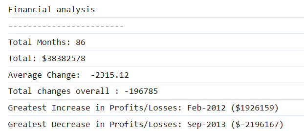

# Console-Finances-CristianB

Financial analysis tool - part of Bootcamp challenge

## Description

This Project was created for bootcamp challenge.

It tests the knowledge gained in the last week, especially the implementation of javascript. 

## Installation

The repository is on public domain and the deployed webpage can be access online at https://docbogdanc.github.io/Console-Finances-CristianB/ where it was deployed using GitHub 

## Usage

The code is free to be used according to the licence condition (please see the licence file from the GitHub repository)

## Credits

- Bootcamp ( a big cheers for bootcamp teachers! ) provided the needed **materials**, the most wanted **inspiration** and the difficult to obtain **motivation**  

  

- w3schools.com from where the information was used to understand the syntax for:
    - Format a Number with Two Decimals 
 
   https://www.w3schools.com/

- Markdown Guide used for styling the readme.md

   https://www.markdownguide.org/basic-syntax/

## License

MIT license

